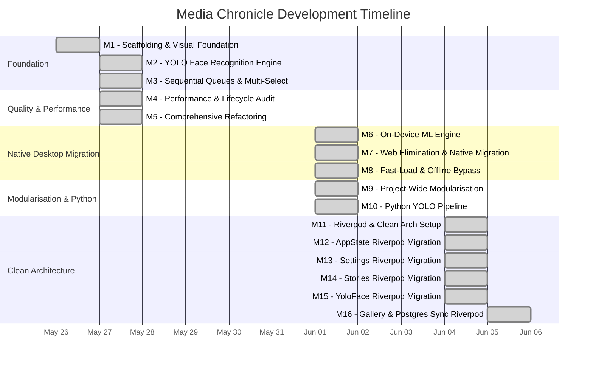

# Milestone Summary: Media Chronicle

This document maintains a high-level summary index of all major achievements, technical audits, and milestones completed in the Media Chronicle repository.

---

## 📅 Milestone Index

### Milestone 1: Initial Scaffolding & Visual Foundation (Completed: May 26, 2026)
*   **Description**: Scaffolded the client-side Flutter application with feature-first folder architecture, Provider state management systems, and the ambient glassmorphic twilight design system.
*   **Design Document**: [01_scaffold_media_chronicle.md](file:///d:/lab/projects/media_chronicle/docs/design_docs/01_scaffold_media_chronicle.md)
*   **Achievements**:
    *   Setup responsive desktop sidebar navigation with session profile metadata, storage meters, and floating menu items.
    *   Implemented compact bottom navigation bar for mobile viewports.
    *   Built custom `MediaHelper` handlers supporting device memory-byte uploads and native file-path reads.
    *   Configured global search query synchronizers filtering stories and gallery assets simultaneously.
    *   Established the premium `Outfit` typography and frosted acrylic card design system.
*   **Audits**:
    *   `flutter analyze` — Clean (No issues found!)
    *   `flutter test` — Clean (Smoke tests pass!)

---

### Milestone 2: YOLO Face Recognition & Online Self-Retraining Engine (Completed: May 27, 2026)
*   **Description**: Built a high-fidelity self-retraining YOLO Face recognition engine featuring glowing interactive face bounding box overlays, age-progression variance validation, 2D vector cluster maps, chronological age timelines, and scrolling backpropagation log terminals.
*   **Design Document**: [02_yolo_self_retraining_face_recognition.md](file:///d:/lab/projects/media_chronicle/docs/design_docs/02_yolo_self_retraining_face_recognition.md)
*   **Achievements**:
    *   Implemented full `YoloFaceProvider` state machine with mock SGD retraining loop.
    *   Engineered responsive floating bounding box overlays using `LayoutBuilder` for pixel-perfect aspect-ratio alignment.
    *   Formed identity timeline galleries showing physical changes over time (childhood → adulthood).
    *   Added low-similarity validations prompting hosts for age progression confirmations on low-confidence matches (>25 embedding distance).
    *   Built custom-painted 2D scatter plot (`YoloEmbeddingsMap`) mapping face vectors with dotted age-progression paths.
*   **Audits**:
    *   `flutter analyze` — Clean (No issues found!)

---

### Milestone 3: Sequential Ingestion Queues & Multi-Select Archive Actions (Completed: May 27, 2026)
*   **Description**: Implemented a robust sequential VLM queue pipeline preventing local Ollama server overloads, coupled with YOLO→VLM prompt sequencing and a premium multi-selection batch action system (Move, Copy, Delete, Re-run VLM).
*   **Design Document**: [03_sequential_queue_multiselect_actions.md](file:///d:/lab/projects/media_chronicle/docs/design_docs/03_sequential_queue_multiselect_actions.md)
*   **Achievements**:
    *   Developed a single-threaded sequential VLM request queue (`_processVlmQueue`) with 90-second timeout and automatic visual fallback on offline states.
    *   Coordinated YOLO synchronous face tagging *first* to feed recognized names into subsequent VLM prompts via `preIdentifiedFaces`.
    *   Formed interactive selection mode in the gallery with checkmark overlays and custom neon borders.
    *   Added Move, Copy, Delete, and Re-run VLM batch action handlers operating on the selection set.
*   **Audits**:
    *   `flutter analyze` — Clean (No issues found!)

---

### Milestone 4: Performance, Lifecycle, & Best Practices Audit (Completed: May 27, 2026)
*   **Description**: Comprehensive refactoring audit resolving controller lifecycle bugs, cursor-jump text input defects, `ScrollController` memory leaks, model immutability violations, repaint boundary inefficiencies, and compiler scoping errors.
*   **Design Document**: [04_architectural_best_practices_refactoring.md](file:///d:/lab/projects/media_chronicle/docs/design_docs/04_architectural_best_practices_refactoring.md)
*   **Achievements**:
    *   Migrated dynamic builder helper methods to class-based `StatelessWidget` and `StatefulWidget` cards across Settings and Gallery screens.
    *   Converted `LlmCard` to `StatefulWidget` to cache inline `TextEditingController`s, resolving typing cursor-jump resets.
    *   Converted `PostgresSyncCard` to `StatefulWidget` to safely manage `ScrollController` initialisation and disposal.
    *   Moved LLM poller initialisation from stateless build scopes into `initState` post-frame callbacks, preventing polling loop re-triggers.
    *   Fixed a nested class scoping syntax error in `gallery_screen.dart` causing 68 compile warnings.
*   **Audits**:
    *   `flutter analyze` — Clean (No issues found!)

---

### Milestone 5: Comprehensive Refactoring & Quality Improvements (Completed: May 27, 2026)
*   **Description**: Resolved all 12 key architectural review findings. Decomposed monolithic screen files into high-performance sub-widgets, established full model immutability contracts, unified duplicate dialog classes, isolated repaint bounds with granular `Selector` models, and created a comprehensive provider testing suite.
*   **Design Document**: [04_architectural_best_practices_refactoring.md](file:///d:/lab/projects/media_chronicle/docs/design_docs/04_architectural_best_practices_refactoring.md)
*   **Achievements**:
    *   Broken down the 2,022-line `gallery_screen.dart` into 8 separate sub-widgets inside a dedicated widgets folder.
    *   Implemented unmodifiable lists in model constructors and safe `copyWith` mappings for strict state immutability.
    *   Replaced inline labelling forms with a unified, dual-step `FaceLabelingDialog`.
    *   Integrated O(1) selective `Selector<YoloFaceProvider, List<DetectedFace>>` grid elements to prevent full-screen rebuild cycles.
    *   Created `providers_unit_test.dart` covering all provider classes.
*   **Audits**:
    *   `flutter analyze` — Clean (No issues found!)
    *   `flutter test` — Clean (All provider and widget test suites passed!)

---

### Milestone 6: On-Device Mathematical Machine Learning Engine (Completed: June 1, 2026)
*   **Description**: Transitioned the YOLO face identification engine from a timed visual simulation to a mathematically rigorous, 100% offline, on-device Single-Layer Perceptron (Multi-Class Softmax Classifier / Logistic Regression) head written in pure Dart.
*   **Design Document**: [02_yolo_self_retraining_face_recognition.md](file:///d:/lab/projects/media_chronicle/docs/design_docs/02_yolo_self_retraining_face_recognition.md)
*   **Knowledge Base**: [05_pure_dart_machine_learning.md](file:///d:/lab/projects/media_chronicle/docs/knowledge_base/05_pure_dart_machine_learning.md)
*   **Achievements**:
    *   Designed a standalone `SingleLayerPerceptron` class executing real Multi-Class Softmax predictions in pure Dart with numerical stability guarantees.
    *   Engineered on-device SGD backpropagation computing exact cross-entropy loss derivatives to update weights and biases locally in milliseconds.
    *   Refactored active learning loops to run true inference probabilities, replacing distance-based thresholds with real prediction confidence boundaries (82–88%).
    *   Auto-recognition inference automatically labels unidentified faces and syncs to PostgreSQL.
*   **Audits**:
    *   `flutter analyze` — Clean (No issues found!)
    *   `flutter test` — Clean (All test suites passed!)

---

### Milestone 7: Web Elimination & Native Desktop Migration (Completed: June 1, 2026)
*   **Description**: Migrated Media Chronicle from a Flutter Web target to a Windows-native-only desktop application. Removed all web-specific conditional imports, established direct native PostgreSQL socket connections, integrated real camera capture, and fixed critical async `BuildContext` lifecycle bugs.
*   **Design Document**: [05_native_desktop_migration.md](file:///d:/lab/projects/media_chronicle/docs/design_docs/05_native_desktop_migration.md)
*   **Achievements**:
    *   **Web Elimination**: Deleted `web/` target build configurations and conditional import wrappers (`postgres_connection_stub.dart`, `postgres_connection_real.dart`).
    *   **Direct PostgreSQL Sync**: Implemented native socket connection logic inside `PostgresSyncService` using `package:postgres/postgres.dart`. Configured automatic DDL schema migrations on start-up.
    *   **Native Media Fetching**: Refactored `MediaHelper` to handle null file bytes on desktop platforms with a dynamic `dart:io` fallback for `PlatformFile.path` reads.
    *   **Real Camera Integration**: Replaced simulated camera capturing with real `ImagePicker(source: ImageSource.camera)` native photo byte retrieval.
    *   **Async Lifecycle Bug Fix**: Resolved silent media import hang where `Navigator.pop(context)` was called before async picker completion, unmounting the `BuildContext`. Solution: synchronously capture all providers and scaffold messenger references *before* async gaps.
    *   **Settings Panel**: Added database configuration panel to toggle and input custom PostgreSQL credentials on the fly.
*   **Audits**:
    *   `flutter analyze` — Clean (No issues found!)
    *   `flutter test` — Clean (All test suites passed!)

---

### Milestone 8: Fast-Load Queue & Offline Bypass Optimisation (Completed: June 1, 2026)
*   **Description**: Eliminated the 90-second socket connection timeout delay when the local Ollama VLM server is offline. Implemented intelligent fast-load bypass detection and real-time UI status indicators.
*   **Design Document**: [06_fast_load_bypass.md](file:///d:/lab/projects/media_chronicle/docs/design_docs/06_fast_load_bypass.md)
*   **Achievements**:
    *   **Fast-Load Bypass**: Added intelligent detection inside `_processVlmQueue` that checks `_isLlmAvailable == false` and instantly skips network connection attempts.
    *   **1.2-Second Fallback**: Engaging the high-fidelity smart visual fallback simulator within 1.2 seconds instead of waiting 90 seconds.
    *   **Status Indicators**: Added real-time glowing VLM & YOLO status indicators (red/green) in both the `DashboardHeader` and `SettingsScreen` cards.
    *   **Background Polling**: 8-second periodic polling timer (`Timer.periodic`) checks Ollama endpoint availability and updates the UI reactively.
*   **Audits**:
    *   `flutter analyze` — Clean (No issues found!)

---

### Milestone 9: Project-Wide Code Modularisation (Completed: June 1, 2026)
*   **Description**: Decompiled three monolithic screen files (`yolo_face_screen.dart`, `settings_screen.dart`, `stories_screen.dart`) into 14 decoupled, single-responsibility sub-widgets with extensive inline documentation.
*   **Design Document**: [07_code_modularisation.md](file:///d:/lab/projects/media_chronicle/docs/design_docs/07_code_modularisation.md)
*   **Achievements**:
    *   **YOLO Face Hub** — Extracted 4 sub-widgets:
        *   `yolo_embeddings_map.dart` — Custom 2D scatter plot with `CustomPainter`, animated cluster nodes, and identity-linked dotted paths.
        *   `yolo_retraining_terminal.dart` — Auto-scrolling backpropagation terminal with monospace log rendering.
        *   `yolo_enrolled_timeline.dart` — Chronological age progression galleries per enrolled identity.
        *   `yolo_unidentified_queue.dart` — Active labelling queue with face thumbnails and label triggers.
    *   **Settings Screen** — Extracted 6 card widgets:
        *   `profile_card.dart`, `llm_card.dart`, `yolo_config_card.dart`, `postgres_sync_card.dart`, `storage_card.dart`, `toggle_card.dart`.
    *   **Stories Screen** — Extracted 4 child widgets:
        *   `story_card.dart`, `stories_empty_state.dart`, `create_story_dialog.dart`, `story_detail_dialog.dart`.
    *   Reduced parent screen files to clean structural layout shells (~50–100 lines each).
    *   Added premium, high-fidelity inline documentation to all 5 YOLO/Settings widgets.
*   **Audits**:
    *   `flutter analyze` — Clean (No issues found!)
    *   `flutter test` — Clean (All test suites passed, 100% success!)

---

### Milestone 10: Python YOLO Training Pipeline & Experimentation Notebook (Completed: June 1, 2026)
*   **Description**: Created a complete, modular Python pipeline for real YOLOv8 face-detection training, inference, evaluation, data preparation, and model export. All scripts use PEP 723 inline script metadata for zero-config `uv run` execution with isolated ephemeral environments. Includes a 9-section Jupyter notebook for interactive experimentation.
*   **Design Document**: [08_python_yolo_pipeline.md](file:///d:/lab/projects/media_chronicle/docs/design_docs/08_python_yolo_pipeline.md)
*   **Achievements**:
    *   **Shared Utilities** (`scripts/utils/`):
        *   `config.py` — Centralised `YoloConfig` dataclass with YAML → environment variable → CLI flag override cascade and automatic project root resolution.
        *   `logging_setup.py` — Idempotent logging factory with Rich console output and rotating file handler (10 MB, 5 backups).
        *   `data_transforms.py` — Albumentations augmentation pipeline builder and annotation format converters (COCO ↔ YOLO ↔ Pascal VOC).
    *   **Pipeline Scripts** (PEP 723 inline metadata):
        *   `yolo_train.py` — Training entrypoint with CLI args, dataset validation, structured JSON stdout streaming for the Flutter `YoloRetrainingTerminal` widget, and Ultralytics training orchestrator.
        *   `yolo_detect.py` — Face-detection inference on single files, directories, or glob patterns. Outputs annotated images and/or JSON results.
        *   `yolo_evaluate.py` — Model evaluation with mAP@50, mAP@50-95, precision, recall, per-class metrics, and confusion matrix generation.
        *   `yolo_data_prep.py` — Sub-command CLI for dataset scaffolding, train/val splitting, COCO/VOC→YOLO annotation conversion, offline augmentation, and dataset statistics.
        *   `yolo_export.py` — Model export to ONNX, TorchScript, TFLite, CoreML, OpenVINO, and TensorRT formats.
    *   **Configuration**: `yolo_config.yaml` with documented hyperparameter defaults.
    *   **Documentation**: `scripts/README.md` with quick-start guide, script overview, and Flutter integration instructions.
    *   **Experimentation Notebook** (`experiments/yolo_pipeline.ipynb`):
        *   §1 Environment setup & configuration
        *   §2 Dataset preparation & exploration with bbox visualisation
        *   §3 Augmentation pipeline preview (8 variants side-by-side)
        *   §4 Model training with live progress
        *   §5 Training metrics visualisation (loss/mAP/precision/recall curves from CSV)
        *   §6 Formal model evaluation
        *   §7 Inference & detection visualisation with drawn bounding boxes
        *   §8 Model export (ONNX)
        *   §9 Embedding cluster analysis, softmax classifier training, and decision boundary visualisation (mirrors Dart `SingleLayerPerceptron`)
    *   **Flutter Integration**: Scripts emit JSON events (`train_start`, `epoch_end`, `train_end`, `detection_complete`, `evaluation_complete`, `export_complete`) to stdout, consumed by `Process.start('uv', ['run', ...])` in the Dart app.
    *   **Updated `.gitignore`** for `runs/`, `datasets/`, `__pycache__/`, `.ipynb_checkpoints/`.
*   **Audits**:
    *   All scripts syntactically valid with PEP 723 metadata.
    *   Flutter codebase unaffected — `flutter analyze` clean.

---

### Milestone 11: Riverpod Integration & Feature-First Clean Architecture Setup (Completed: June 4, 2026)
*   **Description**: Integrated the Riverpod state management framework (including the modern `riverpod_annotation` and code generator syntax) into the project. Standardized the project on a Feature-First, Layered Clean Architecture folder structure, split the MaterialApp setup out of `main.dart` into `app.dart`, and updated the project's dependency configurations.
*   **Design Document**: [09_riverpod_clean_architecture_setup.md](file:///d:/lab/projects/media_chronicle/docs/design_docs/09_riverpod_clean_architecture_setup.md)
*   **Achievements**:
    *   **Riverpod Installation**: Integrated `flutter_riverpod` and `riverpod_annotation` under `dependencies` and configured `riverpod_generator`, `build_runner`, and `riverpod_lint` in `dev_dependencies` inside `pubspec.yaml`.
    *   **App Entry Decoupling**: Created a new `lib/app.dart` file defining the core `App` widget (using `ConsumerWidget`), separating the Material app setup, styling themes, and routing rules from initialization logic.
    *   **Provider Scope Integration**: Simplified `lib/main.dart` to bootstrap the application cleanly using Riverpod's `ProviderScope`, while wrapping the legacy `MultiProvider` configuration to guarantee backward compatibility with existing features during the migration phase.
    *   **Absolute Package Imports**: Cleaned up relative imports in modified theme and test files, enforcing absolute package imports (`package:media_chronicle/...`).
    *   **Scaffold Reference Guide**: Created `lib/features/README.md` to document the layered structure boundaries (`data/`, `domain/`, `presentation/`) and architectural rules for future feature development.
*   **Audits**:
    *   `flutter analyze` — Clean (No issues found!)
    *   `flutter test` — Clean (All provider and widget test suites passed!)

---

### Milestone 12: AppState State Management Migration to Riverpod Notifier (Completed: June 4, 2026)
*   **Description**: Migrated the core `AppState` class from the legacy `ChangeNotifier` to a modern Riverpod `Notifier` using `@riverpod` code generation. Refactored all dependent presentation layer views (Dashboard, Gallery, Stories, and sub-widgets) to watch/read the new provider reactively, keeping the rest of the legacy providers coexisting gracefully.
*   **Design Document**: [09_riverpod_clean_architecture_setup.md](file:///d:/lab/projects/media_chronicle/docs/design_docs/09_riverpod_clean_architecture_setup.md)
*   **Achievements**:
    *   **Immutable State Container**: Defined the immutable `AppStateData` container with copy-constructors and integrated it with `AppState` extending generated `_$AppState`.
    *   **Presentation Refactoring**: Refactored `DashboardShell` and its child panels (`Sidebar`, `DashboardHeader`, `BottomNavBar`), `StoriesScreen`, `GalleryScreen`, and gallery components (`GalleryCategoryFilters`, `GalleryTagCloud`, `GalleryQuickPanel`) to extend Riverpod's `ConsumerWidget` or `ConsumerStatefulWidget`.
    *   **Legacy Scoping Cleanliness**: Removed legacy AppState bindings from `MultiProvider` in [main.dart](file:///d:/lab/projects/media_chronicle/lib/main.dart) while keeping remaining legacy provider states functional.
    *   **Unit Tests Rewrite**: Upgraded AppState unit tests in [providers_unit_test.dart](file:///d:/lab/projects/media_chronicle/test/providers_unit_test.dart) to test the new provider in isolation using Riverpod `ProviderContainer` scopes.
*   **Audits**:
    *   `flutter analyze` — Clean (No issues found!)
    *   `flutter test` — Clean (All tests passed!)

---

### Milestone 13: Settings State Management Migration to Riverpod Notifier (Completed: June 4, 2026)
*   **Description**: Migrated the `SettingsProvider` state from a legacy `ChangeNotifier` pattern to a modern Riverpod `Notifier` managing an immutable `SettingsState`. Refactored all configurations panels, shell screens, upload dialogs, and test suites.
*   **Design Document**: [09_riverpod_clean_architecture_setup.md](file:///d:/lab/projects/media_chronicle/docs/design_docs/09_riverpod_clean_architecture_setup.md)
*   **Achievements**:
    *   **Immutable Settings State**: Formed the immutable `SettingsState` schema class mapping preference options and formatting storage values.
    *   **Control Center Refactoring**: Converted all Settings layout card widgets (Profile, LLM, YOLO, Postgres, Storage, and Toggles) to extend `ConsumerWidget` or `ConsumerStatefulWidget`.
    *   **Orchestration View Adaptation**: Updated `App`, `DashboardShell`, `GalleryScreen`, `GalleryQuickPanel`, and `MediaUploadDialog` to watch or read Riverpod's `settingsProvider`.
    *   **Unit & Widget Test Coverage**: Refactored the unit test groups inside `providers_unit_test.dart` to query settings state in a `ProviderContainer` and removed legacy setup hooks from `widget_test.dart`.
*   **Audits**:
    *   `flutter analyze` — Clean (No issues found!)
    *   `flutter test` — Clean (All tests passed!)

---

### Milestone 14: Stories State Management Migration to Riverpod Notifier (Completed: June 4, 2026)
*   **Description**: Migrated the `StoriesProvider` state from a legacy `ChangeNotifier` pattern to a modern Riverpod `Notifier` managing a type-safe `List<StoryItem>`. Refactored stories dashboard views, card items, creation dialogs, and test suites.
*   **Design Document**: [09_riverpod_clean_architecture_setup.md](file:///d:/lab/projects/media_chronicle/docs/design_docs/09_riverpod_clean_architecture_setup.md)
*   **Achievements**:
    *   **Riverpod Stories Notifier**: Created `Stories` notifier returning a state list containing all story chronicles.
    *   **Stories Screen & Cards Refactoring**: Converted `StoriesScreen` and `StoryCard` to Consumer widgets watching `storiesProvider` and calling notifier deletion actions.
    *   **Draft Dialog Refactoring**: Converted `CreateStoryDialog` to `ConsumerStatefulWidget` to publish new stories using the Riverpod notifier.
    *   **Legacy Cleanup & Test Alignment**: Removed legacy provider configurations in `main.dart` and `widget_test.dart` and refactored tests inside `providers_unit_test.dart` to use `ProviderContainer`.
*   **Audits**:
    *   `flutter analyze` — Clean (No issues found!)
    *   `flutter test` — Clean (All tests passed!)

---

### Milestone 15: YoloFace State Management Migration to Riverpod Notifier (Completed: June 4, 2026)
*   **Description**: Migrated the `YoloFaceProvider` state from a legacy `ChangeNotifier` pattern to a modern Riverpod `Notifier` managing an immutable `YoloFaceState` container. Refactored the interactive cluster map, training logs terminal, identity age timeline, queue cards, and unit test suites.
*   **Design Document**: [09_riverpod_clean_architecture_setup.md](file:///d:/lab/projects/media_chronicle/docs/design_docs/09_riverpod_clean_architecture_setup.md)
*   **Achievements**:
    *   **Immutable Face State**: Defined the immutable `YoloFaceState` model structure with clean copy-constructors and integrated it with `YoloFace` extending generated `_$YoloFace`.
    *   **Interactive Panel Refactoring**: Migrated `YoloFaceScreen`, `YoloConfigCard`, `YoloEmbeddingsMap`, `YoloRetrainingTerminal`, `YoloEnrolledTimeline`, `YoloUnidentifiedQueue`, and `FaceLabelingDialog` to watch/read Riverpod.
    *   **O(1) Grid Optimization**: Converted `GalleryCard`'s selective rebuild indicator badge using type-safe record selector structures.
    *   **Direct overlay and Dialog integration**: Refactored `MediaDetailDialog` and `MediaUploadDialog` to invoke detectors via Riverpod's `yoloFaceProvider`.
    *   **Unit Tests Rewrite**: Upgraded YOLO Face unit tests in [providers_unit_test.dart](file:///d:/lab/projects/media_chronicle/test/providers_unit_test.dart) using a `ProviderContainer` to verify offline machine learning predictions.
*   **Audits**:
    *   `flutter analyze` — Clean (No issues found!)
    *   `flutter test` — Clean (All tests passed!)

---

### Milestone 16: Complete Migration of Gallery & PostgreSQL Sync to Riverpod Notifiers (Completed: June 5, 2026)
*   **Description**: Completed the migration of the final two legacy ChangeNotifier providers (`GalleryProvider` and `PostgresSyncService`) to modern Riverpod Notifiers, completely eliminating the legacy `provider` package from the codebase.
*   **Design Document**: [09_riverpod_clean_architecture_setup.md](file:///d:/lab/projects/media_chronicle/docs/design_docs/09_riverpod_clean_architecture_setup.md)
*   **Achievements**:
    *   **Riverpod Notifiers Migration**: Refactored `GalleryProvider` to `Gallery` and `PostgresSyncService` to `PostgresSync` utilizing the `@riverpod` code generation syntax.
    *   **Elimination of Legacy Code**: Completely removed `MultiProvider` from `main.dart` and `widget_test.dart`, standardizing the app fully on Riverpod.
    *   **Presentation Refactoring**: Ported `GalleryScreen`, `GalleryQuickPanel`, `GalleryTagCloud`, `MediaUploadDialog`, and Settings panels (`LlmCard`, `PostgresSyncCard`) to watch or read the new Riverpod providers.
    *   **Testing Integrity**: Upgraded providers unit tests in `providers_unit_test.dart` and integration tests in `widget_test.dart`. Solved auto-dispose lifecycle resets in asynchronous unit test environments by creating active subscriptions.
*   **Audits**:
    *   `flutter analyze` — Clean (No issues found!)
    *   `flutter test` — Clean (All tests passed!)

---

## 📊 Milestone Timeline



---

## 📁 Current Project Structure

```
media_chronicle/
├── lib/
│   ├── main.dart                          # Minimal app bootstrapper wrapped in ProviderScope
│   ├── app.dart                           # Decoupled MaterialApp coordinator & routing configuration
│   ├── core/
│   │   ├── constants/app_constants.dart   # Theme tokens, spacing, mock data
│   │   ├── theme/app_theme.dart           # Dark theme & font declarations
│   │   ├── widgets/
│   │   │   └── .gitkeep                   # Placeholder for global reusable widgets
│   │   └── utils/
│   │       ├── llm_helper.dart            # Ollama VLM HTTP client
│   │       ├── media_helper.dart          # Native file picking & camera facade
│   │       └── postgres_sync_service.dart # Direct PostgreSQL socket sync
│   ├── features/
│   │   ├── README.md                      # Feature-First Clean Architecture reference guide
│   │   ├── gallery/
│   │   │   ├── models/
│   │   │   │   ├── media_item.dart        # Immutable media element + SHA-256
│   │   │   │   ├── detected_face.dart     # Face bbox, embeddings, identity
│   │   │   │   └── album.dart             # Memory folder container
│   │   │   ├── providers/
│   │   │   │   ├── gallery_provider.dart   # Media catalog + VLM queue
│   │   │   │   └── yolo_face_provider.dart # YOLO detection + SingleLayerPerceptron
│   │   │   └── views/
│   │   │       ├── gallery_screen.dart     # Masonry grid, lightboxes, uploads
│   │   │       ├── yolo_face_screen.dart   # YOLO Hub layout shell
│   │   │       └── widgets/
│   │   │           ├── gallery_card.dart
│   │   │           └── yolo/
│   │   │               ├── yolo_embeddings_map.dart
│   │   │               ├── yolo_enrolled_timeline.dart
│   │   │               ├── yolo_retraining_terminal.dart
│   │   │               └── yolo_unidentified_queue.dart
│   │   ├── settings/
│   │   │   ├── providers/settings_provider.dart
│   │   │   └── views/
│   │   │       ├── settings_screen.dart    # ListView shell
│   │   │       └── widgets/
│   │   │           ├── profile_card.dart
│   │   │           ├── llm_card.dart
│   │   │           ├── yolo_config_card.dart
│   │   │           ├── postgres_sync_card.dart
│   │   │           ├── storage_card.dart
│   │   │           └── toggle_card.dart
│   │   └── stories/
│   │       ├── models/story_item.dart
│   │       ├── providers/stories_provider.dart
│   │       └── views/
│   │           ├── stories_screen.dart     # Coordinator shell
│   │           └── widgets/
│   │               ├── story_card.dart
│   │               ├── stories_empty_state.dart
│   │               ├── create_story_dialog.dart
│   │               └── story_detail_dialog.dart
│   └── state/
│       ├── app_state.dart                 # AppState Notifier managing navigation & search state
│       └── app_state.g.dart               # Generated Riverpod file
├── scripts/                               # Python YOLO pipeline
├── experiments/
├── docs/
│   ├── design_docs/                       # Milestone design documents
│   └── knowledge_base/                    # Technical lessons learned
├── test/                                  # Flutter unit & widget tests
├── windows/                               # Native Windows runner
└── pubspec.yaml
```
