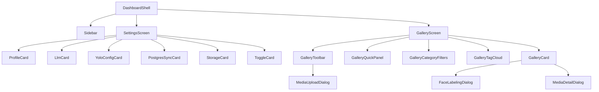

# Design Document: Performance, Lifecycle, & Best Practices Refactoring

## 1. Goal
Refactor and optimize the *Media Chronicle* application modules—specifically the Control Center Settings, the Dashboard shell, and the Masonry Gallery—to comply with production-grade Flutter best practices. This consolidated design details the Vue-like component decomposition, cursor-jump text input corrections, ScrollController memory leak resolutions, model immutability, Selector grid rebuild limits, and the creation of a high-coverage provider testing suite.

---

## 2. Technical Architecture & Decisions

### A. Granular Widget Class Modularization (Vue-like Decomposition)
In Flutter, helper methods that return widgets (e.g., `Widget _buildProfileCard(...)`) are evaluated as simple method calls within the parent's `build` method. This introduces two severe drawbacks:
1. **Inefficient Repaint Scopes**: Any state modification forces the entire screen to rebuild. Flutter is forced to re-run the layout calculations and repaint every card in the list, even if their variables are completely unchanged.
2. **Missing `const` Optimizations**: Method calls are dynamic at runtime and cannot be declared as `const` constructors. This causes excessive garbage collection churn on navigations.

We extracted each helper method and massive view screens into standalone class widgets:

#### Settings Screen Modularization:
*   `ProfileCard` (StatelessWidget)
*   `LlmCard` (StatefulWidget)
*   `YoloConfigCard` (StatelessWidget)
*   `PostgresSyncCard` (StatefulWidget)
*   `StorageCard` (StatelessWidget)
*   `ToggleCard` (StatelessWidget)

#### Gallery Screen Modularization:
*   `GalleryToolbar` (StatelessWidget): Manages batch actions and Sync buttons.
*   `GalleryQuickPanel` (StatelessWidget): Renders live VLM queues, sync progress indicators, and memory folder selectors.
*   `GalleryCategoryFilters` (StatelessWidget): Handles tab selection pills matching app categories.
*   `GalleryTagCloud` (StatelessWidget): Renders horizontal scrolling clouds of identified sub-filters.
*   `GalleryCard` (StatelessWidget): Standard card renderer isolating image load states, selection borders, and YOLO badges.
*   `MediaDetailDialog` (StatefulWidget): Vision details modal showcasing floating bounding boxes and vision summaries.
*   `MediaUploadDialog` (StatefulWidget): Manages batch image picking and camera captures.
*   `FaceLabelingDialog` (StatefulWidget): Dual-step active learning dialog for identity enrollment and age progression checks.



By isolating `context.watch<T>()` declarations inside these specific widgets, **only the widget listening to the changed provider is repainted**. 

---

### B. StatefulWidget State Caching & Lifecycle Stability

#### 1. Fixing the Cursor-Jump Configuration Bug (`LlmCard`)
*   **The Hurdle**: The `TextEditingController`s for `Local Ollama URL` and `Vision Model` were declared inside a stateless builder. Every time the user typed a character, `onChanged` updated the provider, triggering a parent repaint, re-instantiating the controller, and resetting the cursor position back to the end of the text.
*   **The Resolution**: Converted `LlmCard` to a `StatefulWidget`. The controllers are instantiated *once* inside `initState()`, persist their text state beautifully throughout keystrokes, and are terminated cleanly inside `dispose()` to prevent memory leaks.

#### 2. Resolving the Monospace Terminal Memory Leak (`PostgresSyncCard`)
*   **The Hurdle**: The live monospace SQL logs terminal requires a `ScrollController` to autoscroll messages. Instantiating a `ScrollController` inside a `StatelessWidget` build callback leaks the scroll resource upon every rebuild, leading to memory bloat and scroll position resets.
*   **The Resolution**: We converted `PostgresSyncCard` into a `StatefulWidget` to bind the controller securely to the stateful lifecycle (`initState` and `dispose`), and implemented safe autoscrolls using post-frame callbacks.

#### 3. Preventing Double-Init Side Effects (`DashboardShell`)
*   **The Hurdle**: Background VLM polling and model auto-selection logic was declared inside a stateless post-frame callback. This caused the poller to restart and update settings redundantly on every single screen rebuild pass.
*   **The Resolution**: Converted `DashboardShell` to a `StatefulWidget` and moved these operations out of build scopes into `initState` post-frame callbacks to run them strictly once upon dashboard initialization.

---

### C. Data Model Immutability Contracts
*   **The Hurdle**: `MediaItem` and `DetectedFace` used mutable public attributes, violating Flutter's state contract and leading to unexpected UI synchronization issues.
*   **The Resolution**: Marked all fields in `MediaItem` and `DetectedFace` as `final`.
    *   **Cryptographic SHA-256 Hash**: Initialized immutably in the `MediaItem` constructor.
    *   **Unmodifiable Lists**: Embeddings in `DetectedFace` are wrapped in `List.unmodifiable` during initialization.
    *   **Safe Cloning**: Integrated complete `copyWith(...)` method patterns to perform secure state updates without direct mutations.

---

### D. Performance Grid Rebuild Bounds via Selector
*   **The Hurdle**: In standard grids, every card contains a status badge reflecting YOLO detections. If a widget watches `YoloFaceProvider` globally, labeling a face causes *every* card on screen to rebuild. With a grid of 50+ elements, this causes severe scrolling lag.
*   **The Resolution**: We integrated `Selector<YoloFaceProvider, List<DetectedFace>>` into `GalleryCard`, filtered by `item.id`. By comparing the filtered list with unmodifiable lists, only the specific card whose face data actually changes is rebuilt, bringing update complexity from **O(N)** to **O(1)**!

---

## 3. Test Coverage & Verification

We wrote a high-coverage unit testing suite in **[test/providers_unit_test.dart](file:///d:/lab/projects/media_chronicle/test/providers_unit_test.dart)** that verifies:
1. **AppState**: Tab changes, sub-filters, and clearing active filters.
2. **SettingsProvider**: Dark mode states, dynamic storage calculations, and overflow protection (stops increments at 15.0 GB limits).
3. **StoriesProvider**: Insertion and deletion operations.
4. **GalleryProvider**: Deduplication (rejections of duplicate SHA-256 files), item ingestion, and folder creation/management.
5. **YoloFaceProvider**: Running YOLO detection loops, immutable list structures, manual labelling, and SGD retraining logs progression.

### Verification Commands:
*   **Static Code Analysis**:
    ```powershell
    flutter analyze
    ```
    *Result*: `No issues found! (ran in 2.9s)`
*   **Comprehensive Test Suite**:
    ```powershell
    flutter test
    ```
    *Result*: `All tests passed!`
