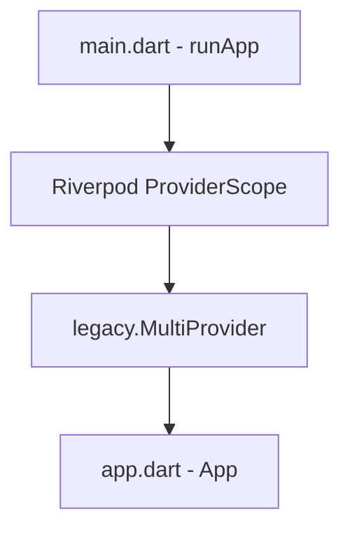

# Design Document: Riverpod Integration & Feature-First Clean Architecture

## 1. Goal
Transition the *Media Chronicle* architecture to support Riverpod state management using modern `@riverpod` annotations and the Riverpod generator. Standardize the codebase on a Feature-First, Layered Clean Architecture structure to keep UI code decoupled from business logic and verify dependency setup.

---

## 2. Technical Architecture & Decisions

### A. Feature-First Layered Clean Architecture
To ensure scalability, maintainability, and testing boundaries, every new feature must reside in a dedicated directory under `lib/features/` and follow this layout:

```
lib/features/[feature_name]/
├── data/
│   ├── datasources/   # Local/Remote database & network clients
│   └── repositories/  # Repository implementations
├── domain/
│   ├── entities/      # Pure Dart domain models & objects
│   └── repositories/  # Repository interfaces (contracts)
└── presentation/
    ├── providers/     # Riverpod providers (@riverpod generator syntax)
    ├── screens/       # Main screen widgets
    └── widgets/       # Feature-specific sub-widgets
```

This ensures a strict separation of concerns:
*   **Domain Layer (Entities & Repository Contracts)**: Holds the core business models and interfaces. It must not depend on any presentation framework or external data providers.
*   **Data Layer (Datasources & Repository Implementations)**: Handles raw data fetch operations, API integrations, caching, and mapping raw JSON database rows to domain entities.
*   **Presentation Layer (UI Screens, Sub-widgets, and Riverpod Providers)**: Manages UI rendering and handles interactive state. UI widgets are forbidden from running complex operations; they watch Riverpod providers to react to changes.

---

### B. Riverpod State Management Setup
We integrated the latest Riverpod ecosystem dependencies:
*   `flutter_riverpod` for UI-to-provider bindings.
*   `riverpod_annotation` and `riverpod_generator` for type-safe code generation, eliminating boilerplate provider declarations.
*   `build_runner` for runtime code generation.
*   `riverpod_lint` for static analysis rules enforcing clean Riverpod patterns.

To ensure a smooth transition, we wrapped the application in a hybrid environment where Riverpod's `ProviderScope` coexists with the legacy `MultiProvider` configuration:



This hybrid scope guarantees that existing screens powered by the legacy `provider` package continue to compile and function normally, while new features can be constructed entirely with Riverpod.

---

### C. Entry Point Decoupling & Absolute Imports
*   **Entry Point Separation**: The Material application setup, theme mapping, and home-screen routing were refactored out of `main.dart` into `lib/app.dart`. `main.dart` remains a minimal, clean bootstrap entry.
*   **Absolute Package Imports**: All modified files were upgraded to absolute imports (`package:media_chronicle/...`), preventing name collisions and layout confusion.

---

## 3. Verification Plan
*   **Static Code Analysis**: Run `flutter analyze` to ensure compilation and lint compliance.
*   **Unit Tests**: Run `flutter test` to verify that existing ChangeNotifier-based unit tests remain unaffected.
